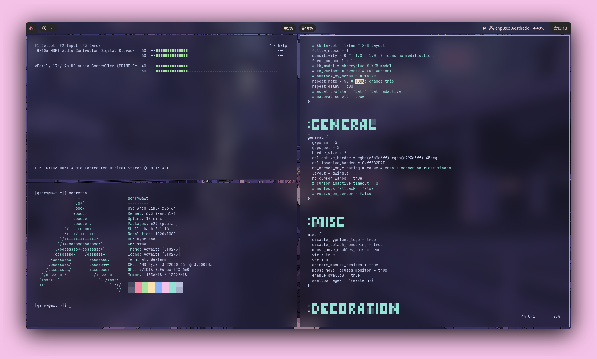

<div align="center">
    <h1><strong>Configuracion Hyprland</strong></h1>
    
</div>

# Instalacion
```sh
paru -S hyprland-git hyprpicker-git waybar-hyprland-git dunst nwg-look wf-recored wlogout wlsunset
```

## Prerequisitos
paru

# References
- [Hyprland](https://hyprland.org/) - Pagina principal del wm
- [Artix Linux](https://artixlinux.org/) - Distribucion elegida (runit)
- [Configuracion](https://github.com/linuxmobile/hyprland-dots) - linuxmobile
